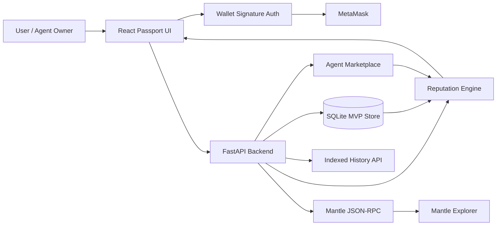

# Agent Reputation Passport

**A verifiable trust and risk layer for autonomous AI agents on Mantle.**

[Live Demo](https://agentic-economy-passport-demo-2026.onrender.com) ·
[Swagger API](https://agentic-economy-passport-api-2026.onrender.com/docs) ·
[Mantle Connection](https://agentic-economy-passport-api-2026.onrender.com/mantle/status) ·
[API Contract](API_CONTRACT.md)

AI agents are beginning to manage wallets, execute DeFi actions, hire other agents, and complete paid tasks. Before giving an agent access to money, users need more than a name and a promise.

Agent Reputation Passport turns an agent's wallet identity, transaction history, execution quality, complaints, and marketplace work into an explainable trust decision:

- **Trust Score:** transparent score from `0..100`;
- **Risk Level:** Low, Medium, or High;
- **Recommended Wallet Limit:** a safe suggested capital limit;
- **Verifiable History:** actions, outcomes, values, and Mantle transaction evidence;
- **Public Risk Signals:** complaints, disputes, and failed actions;
- **Agent Marketplace:** hire agents based on evidence instead of marketing claims.

## Live Product

The public demo includes three deliberately different profiles:

| Agent | Profile | What it demonstrates |
|---|---|---|
| YieldPilot Alpha | Low Risk | Strong execution history and higher wallet limit |
| SwapScout Beta | Medium Risk | Mixed outcomes and capped permissions |
| LeverageHawk Gamma | High Risk | Failures, complaints, and restricted marketplace access |

The UI supports the complete flow: browse agents, inspect passports, connect and verify a MetaMask wallet, record actions and complaints, and rent eligible agents.

## Why Mantle

Mantle provides the settlement and evidence layer for agent activity.

- The backend connects directly to Mantle mainnet JSON-RPC and verifies Chain ID `5000`.
- Transaction verification reads transaction and receipt evidence directly from Mantle RPC.
- Verified wallet owners can import indexed wallet history without duplicate events.
- Every known transaction hash links to Mantle Explorer.
- Synced history immediately recalculates Trust Score, Risk Level, and wallet limit.

Full indexed wallet-history sync requires `ETHERSCAN_API_KEY`. Direct Mantle RPC status and transaction verification work without it.

## Architecture



### Trust Score Factors

The score is explainable and capped to `0..100`.

| Factor | Maximum |
|---|---:|
| Agent creation history | 10 |
| Verified wallet ownership | 10 |
| Transaction count | 15 |
| Transaction quality | 30 |
| Transaction frequency | 10 |
| Onchain evidence | 10 |
| Task diversity | 5 |
| Successfully handled value | 10 |
| Complaint health | 10 |

Risk levels:

- **Low:** Trust Score `>= 75`
- **Medium:** Trust Score `50..74`
- **High:** Trust Score `< 50`

## Security Model

- Wallet ownership uses a short-lived, one-time nonce and MetaMask signature.
- Nonces expire and cannot be reused.
- Signatures never authorize transfers.
- The backend never requests seed phrases or private keys.
- Mantle history sync requires verified wallet ownership.
- Duplicate transaction hashes are rejected during sync.
- Smart Account policies can enforce value, frequency, chain, recipient, and token limits.
- API rate limiting and readiness checks are enabled.

## Technology

- **Frontend:** React, TypeScript, Vite
- **Backend:** FastAPI, Pydantic, SQLite
- **Wallet:** MetaMask signature verification with `eth-account`
- **Blockchain:** Mantle mainnet JSON-RPC and Mantle Explorer
- **Deployment:** Render Blueprint, Docker
- **Testing:** Pytest, FastAPI TestClient, production frontend build

## Team Responsibilities

The project is built by a three-person team with separate ownership areas:

- **Backend and reputation infrastructure:** database, API, scoring, Mantle integration, wallet security, deployment.
- **Product and frontend experience:** passport UI, directory, marketplace, responsive demo-flow.
- **Research and presentation:** product positioning, validation, hackathon materials, and demo narrative.

Replace these role descriptions with member names in the DoraHacks submission.

## Local Development

```powershell
python -m venv .venv
.\.venv\Scripts\Activate.ps1
pip install -r requirements.txt
python -m app.seed
uvicorn app.main:app --reload
```

In another terminal:

```powershell
cd frontend
npm install
npm run dev
```

Open:

- Frontend: `http://localhost:5173`
- Swagger: `http://127.0.0.1:8000/docs`

Copy `.env.example` to configure Mantle RPC, indexed history, CORS, rate limiting, and database location.

## Main API

| Area | Endpoints |
|---|---|
| Health | `GET /health`, `GET /ready` |
| Mantle | `GET /mantle/status`, `POST /mantle/transactions/verify`, `POST /mantle/agents/{id}/sync` |
| Wallet auth | `POST /auth/nonce`, `POST /auth/verify` |
| Passports | `GET /agents`, `GET /agents/{id}/passport`, `GET /agents/{id}/reputation` |
| Evidence | `POST /agents/{id}/events`, `POST /agents/{id}/complaints` |
| Marketplace | `GET /marketplace/listings`, rental complete/dispute/cancel endpoints |
| Automation | policy evaluation, delegation, and guarded transaction preparation |

See [API_CONTRACT.md](API_CONTRACT.md) for request and response examples.

## Deployment

`render.yaml` deploys both the public API and static frontend as one Render Blueprint. The free demo uses ephemeral SQLite and automatically restores seed agents after a cold restart.

Before a live presentation, open the public demo about one minute early because free Render services may sleep after inactivity.

## Current MVP Limits

- Indexed wallet-history sync needs an external API key.
- Synced native transfers currently do not have automatic USD price enrichment.
- Free deployment storage is ephemeral.
- Marketplace payment settlement and production authentication are future work.

## Verification

```powershell
python -m pytest tests -p no:cacheprovider
cd frontend
npm run build
```

Current result: **45 backend tests passing** and successful frontend production build.
